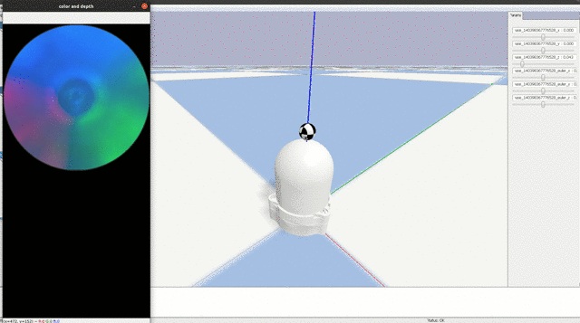
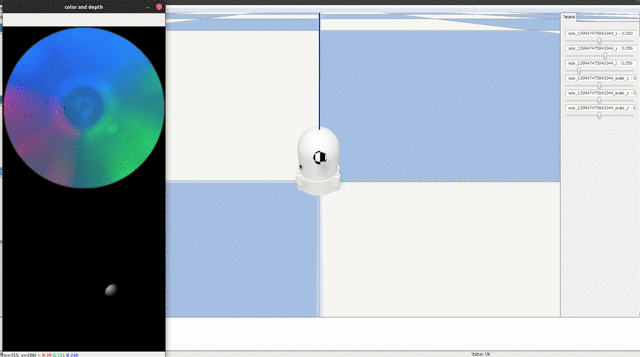

# Allsight_Sim : An Open-source Simulator for Allsight Tactile Sensor

## Overview
This package provides a simulator for a compact 3D strcutured vision-based Allsight finger sensor. It provides the Allsight model integration with [TACTO](https://github.com/facebookresearch/tacto) API simulation and a data collection process for robotic in-hand manipulation use cases.
For more information refer to the corresponding paper **edit** ...

---
## Installation

The code has been tested on:
- Ubuntu 18 / 20 
- python >= 3.6

Clone the repository:

```bash
git clone git@github.com:osheraz/allsight_sim.git
cd allsight_sim
```

Install the dependencies:

```bash
pip install -r requirements/requirements.txt
```

---

## Usage 

- [experiments/00_demo_pybullet_allsight.py](experiments/00_demo_pybullet_allsight.py): rendering RGB and Depth readings with Allsight sensor.




- [experiments/01_collect_data_sim.py](experiments/01_collect_data_sim.py): rendering RGB and Depth readings with Allsight sensor.




NOTE: Adjust simulation parameters on [experiments/conf](experiments/conf) folder. 

---

## License

This project is licensed under MIT license, as found in the [LICENSE](LICENSE) file.


